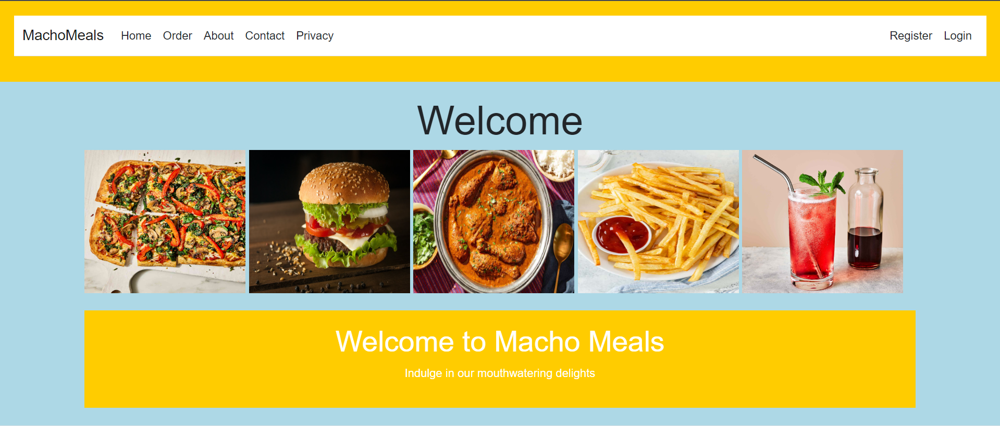
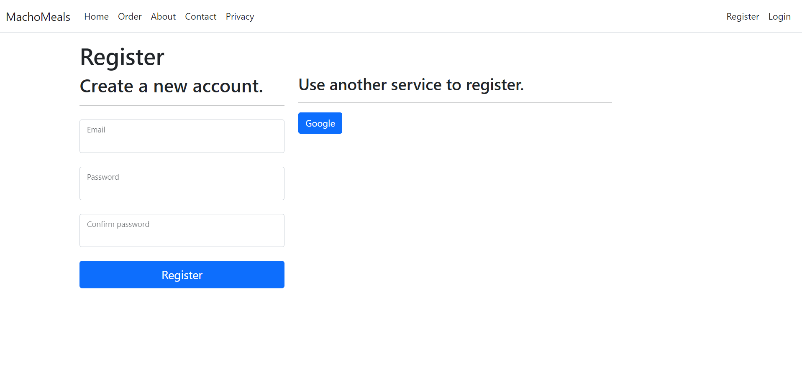
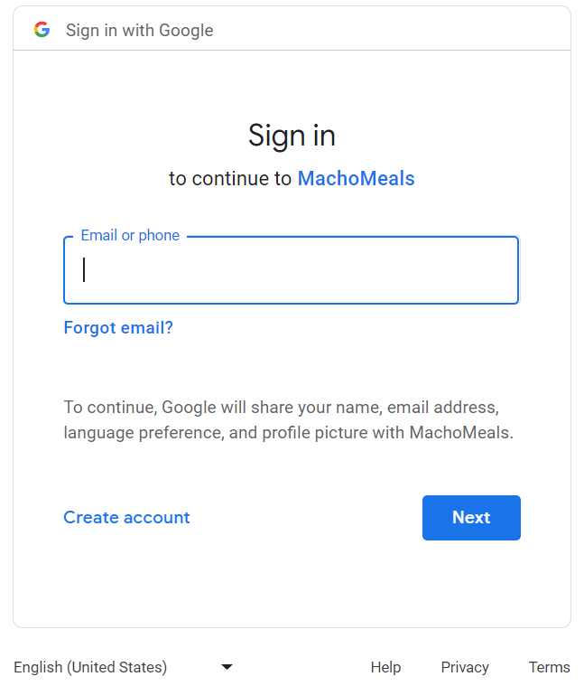
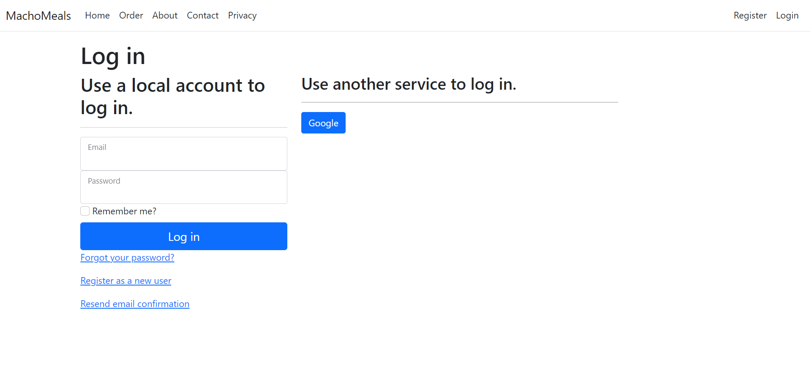
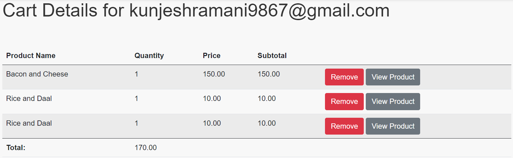
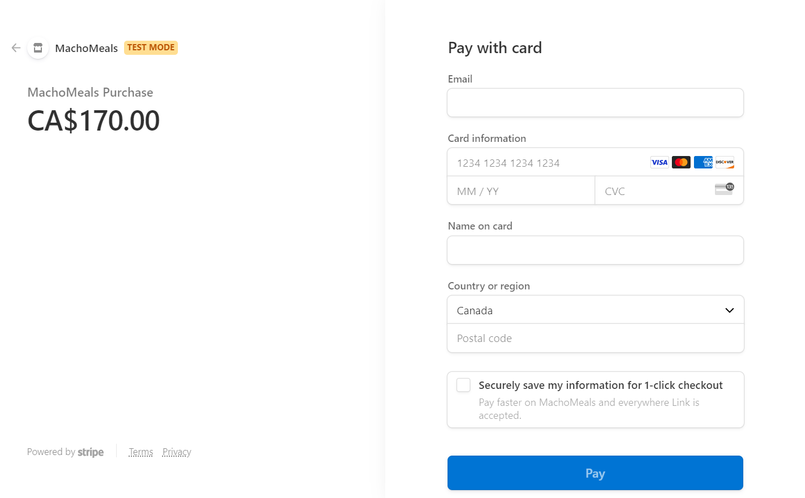
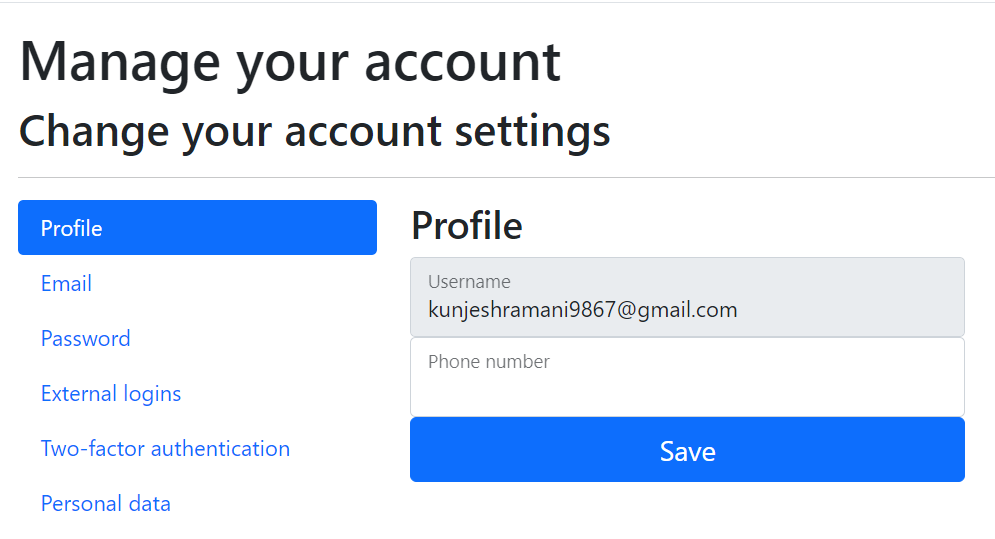

div# **MachoMeals**

## **Introduction**

The name of the project is Macho Meals. It is an online food delivery service app.
The goal of this project is to serve as an online ordering platform where users can
obtain details about menu items, costs, deals, and nearby locations. The overall
purpose of this fast-food website is to offer a user-friendly environment that
encourages online communication, increases convenience, and advertises different
food and services to a large audience

## **Why will this application be useful?**

This online food delivery app would combine convenience, variety, and user-
friendly features to improve the whole ordering and delivery experience for
customers while enabling businesses to increase their customer base and boost
their business processes. Some of its benefits include the following:
 Convenience Customers can get food from a variety of eateries using apps
that deliver food online without ever leaving their homes or workplaces.
 Easy Ordering Process: Using an app to place a food order tends to be simple
and quick. With only a few clicks on their mobile phones, customers can
browse menus, customize orders, and specify delivery requirements.
Rewards and promotions: Fast food restaurants frequently incorporate
rewards and programs where customers can get points and receive
discounts. This kind of website allows customers to track these from
their fingertips. Customer Feedback and Review: The website includes features that allow
customers to provide feedback, rate their experiences, and write reviews.

| Views           |
| :---            |
| Admin           |
| Customer        |
| General Public  |

## **Programming Language and Technologies used**

* [x] ASP.NET Framework

* [x] Microsoft SQL

* [x] Microsoft Azure

* [x] HTML, CSS & JS

* [x] Visual Studio

* [x] Git

## **Concepts Used**

> 1. Scaffolding
>
> 2. Google Authentication
>
> 3. Stripe Payment
>
> 4. Cloud Data Storage

## **Resources**

1. College Lectures
2. Google

## **Screenshots**

<h2><b>Home Page</b></h2>

<h2><b>Registration </b></h2>

 

<h2><b>Login</b></h2>

<h2><b>Cart Detail of Customer</b></h2>

<h2><b>Stripe Payment</b></h2>

<h2><b>Manage your Account</b></h2>

# 
**A Big Thank You!**

