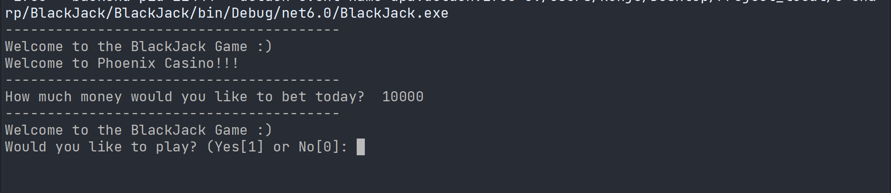
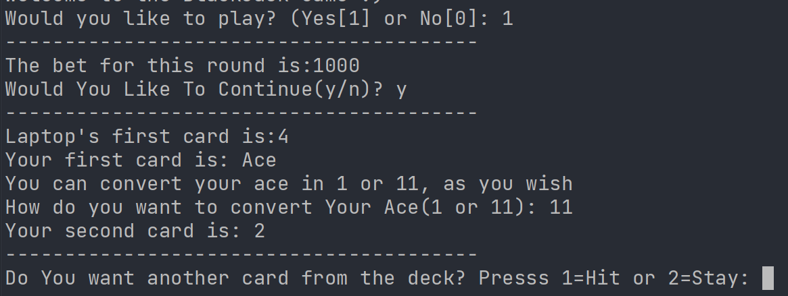
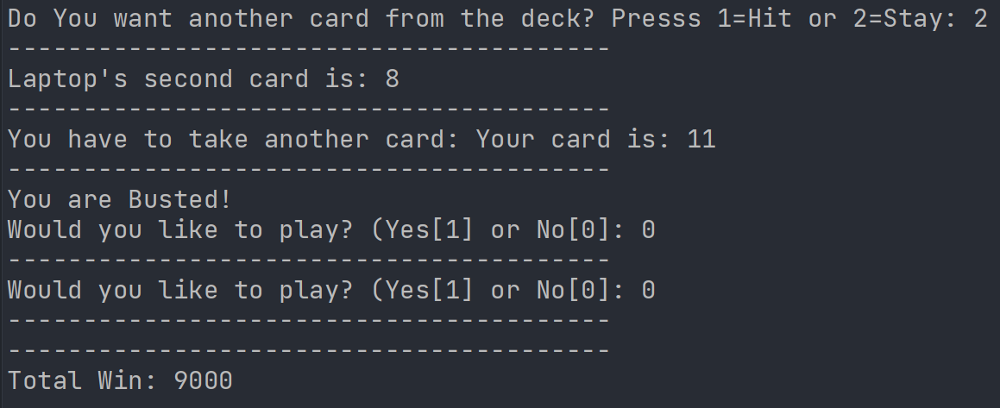

# BlackJack

## Players
- [x] Player (User)
- [x] Laptop (Dealer)
 
 ## Introduction

 - In this Assignment, I have created a Console-based game between a player and laptop
 - It is a simple Blackjack game.
 - It comprises all the rules.
 - The cards of the laptop are automated.
 - It has a catchy design to easily go through the game.

 ## Project features
 - You can play this game in your leisure time ;)  
  
## Programming Language and Technologies used
 
 - [x] C#
 - [x] JetBrains Rider

## Resources
* College Notes
* YouTube Tutorials
* W3Schools
* GeeksforGeeks
* Stack Overflow

## Website Screenshots

### Game Screenshots

1. Introduction 

 

2. Main interface

* Page-1

* Page-2

# Thank You

