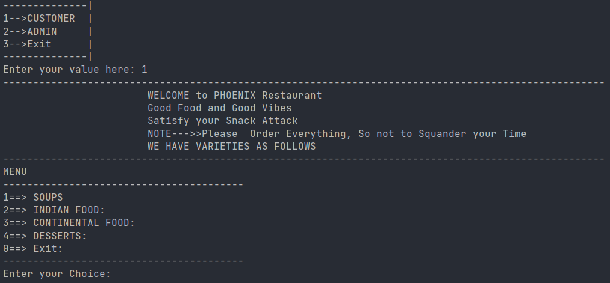
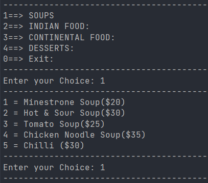
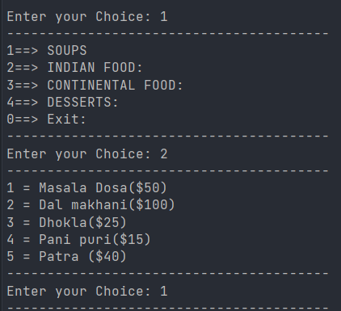
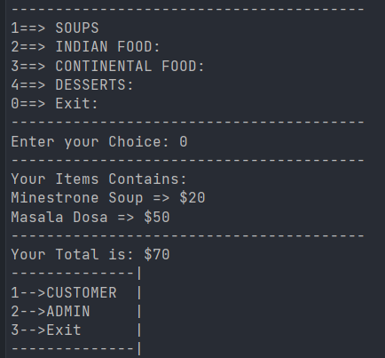
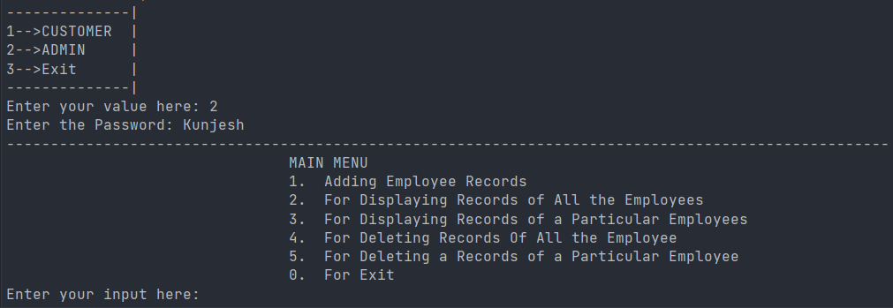
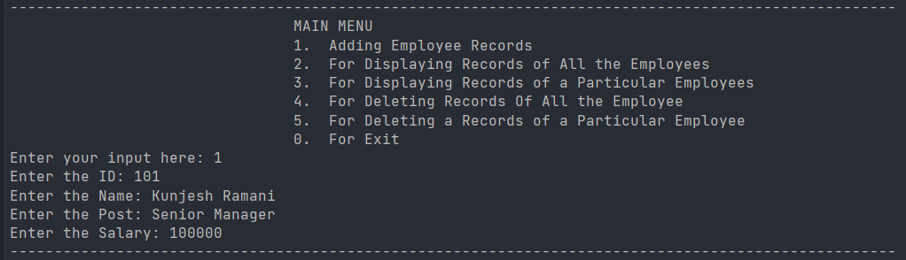
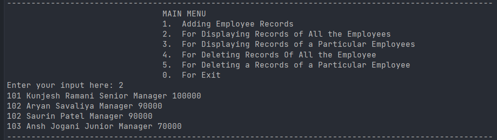
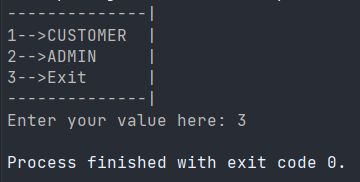

# Restaurant Management

# Interfaces
1. CUSTOMER
2. ADMIN 
3. Exit

 ## Introduction

 - In this Assignment, I have created a Console-based Restaurant management system.
 - There are 3 interfaces.

| CUSTOMER                                                                 | ADMIN                      | Exit                  |
|:---                                                                      | :---                       |:---                   |
| Welcome message for customers                                            | Enter a Password to log in | To terminate the loop |
| Display main menu items                                                  | Get a Main Menu Interface  |                       |
| Customers will choose a main menu item (Eg: Soup)                        | Can perform various tasks  |                       |
| Out of given options (Eg: Chicken Noodle Soup), customer will choose one | Exit                       |                       |
| After choosing, customer will direct to menu item                        |                            |                       |
| Customers will choose another menu item                                  |                            |                       |
| At the end of order, customer will get subtotal                          |                            |                       |
|                                                                          |                            |                       |

 - It has a basic design to easily follow the code .
 - Code is well-indented, formatted and comments are added where required.

 ## Project features
 - This idea can be implemented in real life applications.
 - To enhance user's experience, GUI can be added.
  
## Programming Language and Technologies used
 
 - [x] C#
 - [x] JetBrains Rider

## Resources
1. College Notes
2. W3Schools
3. GeeksforGeeks
4. Stack Overflow

### Screenshots

1. **Customer**

Introduction & Main Menu

 

Choosing a specific item from menu

Returning to Main Menu & Choosing another item

Completing the order & displaying Subtotal 

2. **Admin**

Asking for Password & Displaying Main Menu

 

Adding Employee Record

Displaying All Employee Record

3. **Exit**

Terminating the Program

# 
**A Big Thank You!**

