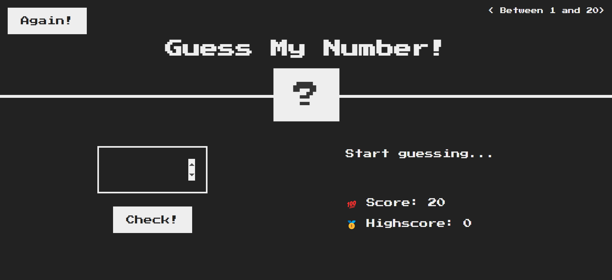
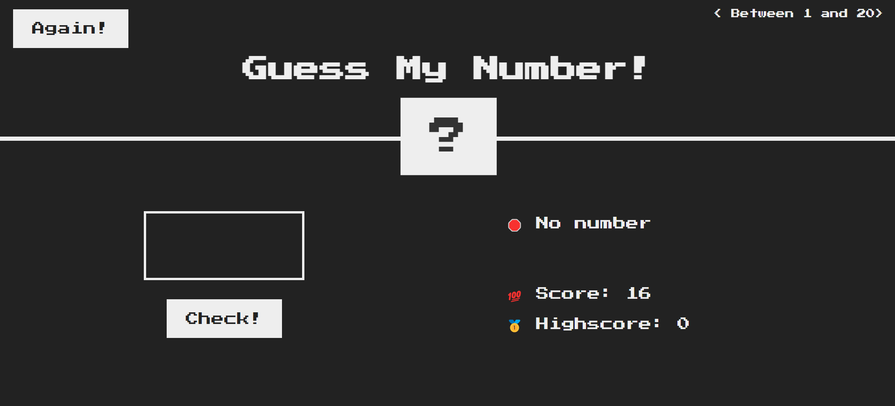
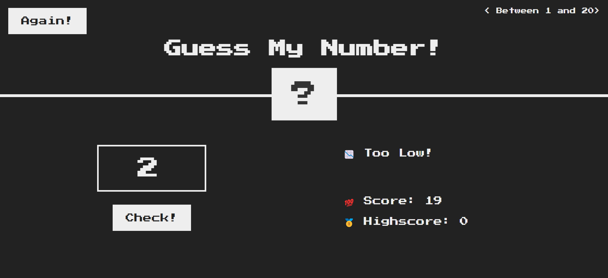
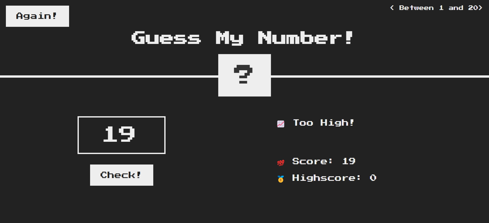
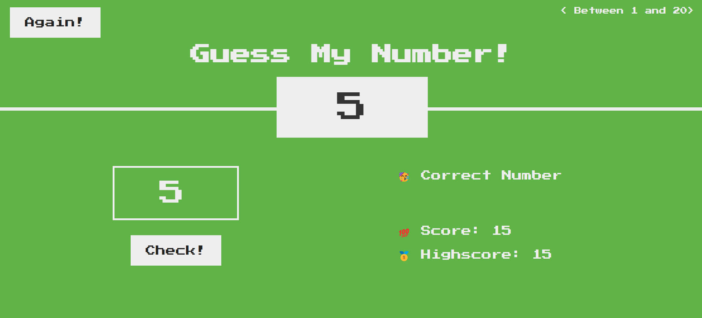
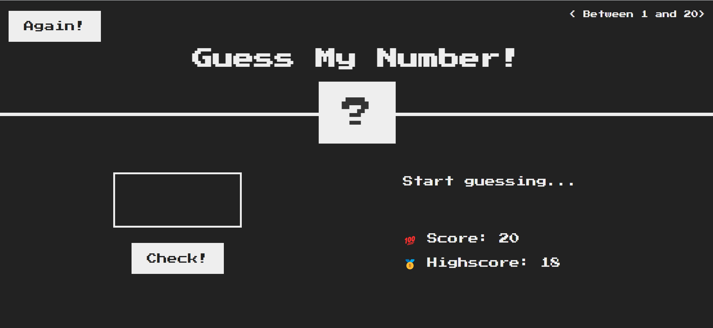

# **Guess-My-Number**

## **Introduction**

* ### In this game, computer will generate a random number between 1 and 20 and user will have to guess it

* ### Each time user guess incorrectly, 1 point will be deducted from Score

* ### At the end, Highscore will be noted

You can clone & run this game in your PC.

## **Programming Language and Technologies used**

* [x] HTML, CSS & JS

* [x] Visual Studio Code

* [x] Git

## **Concepts Used**

> 1. Basic HTML & CSS
>
> 2. querySelector
>
> 3. getElementById
>
> 4. addEventListener

## **Resources**

1. Online Lectures
2. Google

## **Screenshots**

<h2><b>1. Initial Screen</b></h2>

---
---

<h2><b>2. No Number</b></h2>

---
---

<h2><b>3. When number is Too Low!</b></h2>

---
---

<h2><b>4. When number is Too High!</b></h2>

---
---

<h2><b>5. Correct Number</b></h2>

---
---

<h2><b>6. Restarting the Game again!</b></h2>

 

# 
**A Big Thank You!**

