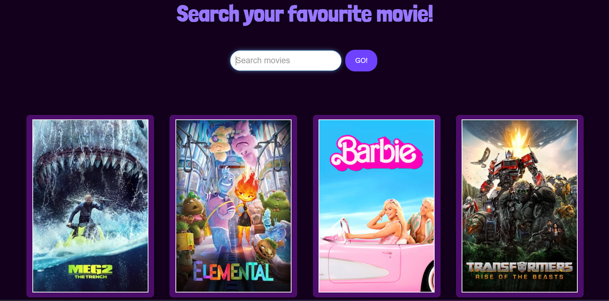
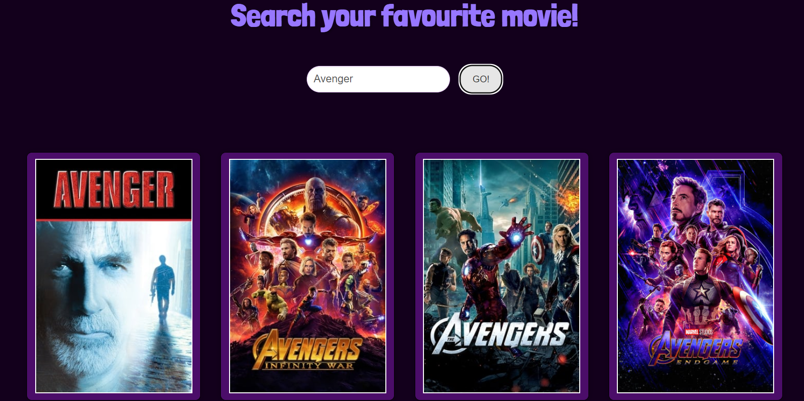

# **Movie Search**

## **Introduction**

* #### An online website to search for movie posters that fetch data using REST API

## **Programming Language and Technologies used**

* [x] HTML, CSS & JS

* [x] REST API

* [x] Visual Studio Code

* [x] Git

## **Resources**

1. Class Concepts
2. Google

## **Screenshots**

    

# 
**A Big Thank You!**

