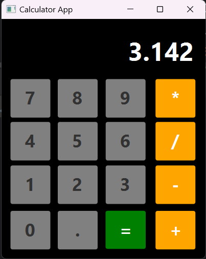

# **Calculator GUI**

## **Introduction**

In this Project, I have created a GUI of Calculator.

It's just an GUI. Calculator is not working at this moment.

 
## **Programming Language and Technologies used**
 
- [x] Java
- [x] SceneBuilder
- [x] JetBrains IntelliJ
- [x] Git

## **Concepts Used**
> Containers (AnchorPane, BorderPane, Button, Label etc.)
>
> Some Formatting (color, font-size, height, width, alignment etc.)

## **Resources**
1. College Notes

## **GUI Screenshots**

<h3>Running HelloApplication.java file and displaying Output</h3>

 

# 
**A Big Thank You!**

