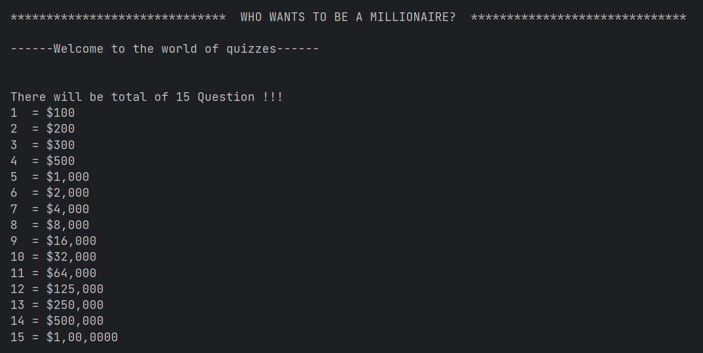
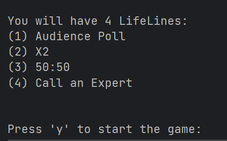
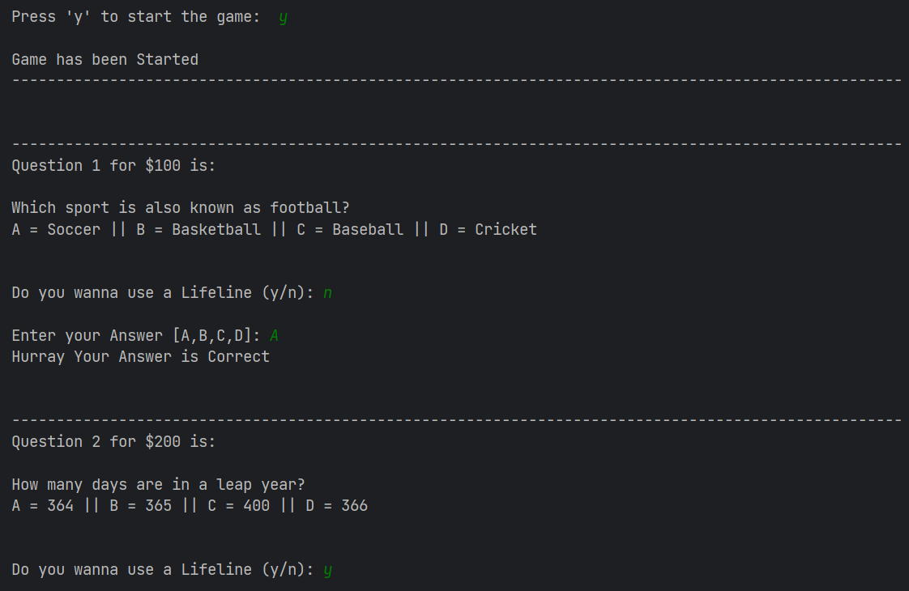
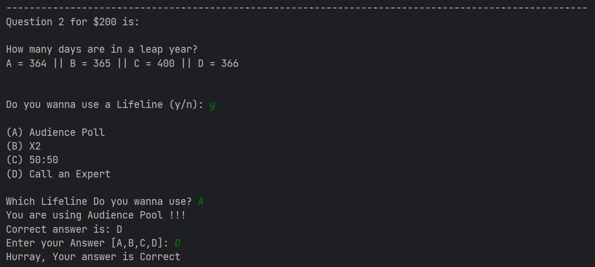
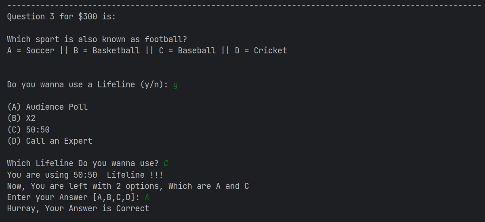
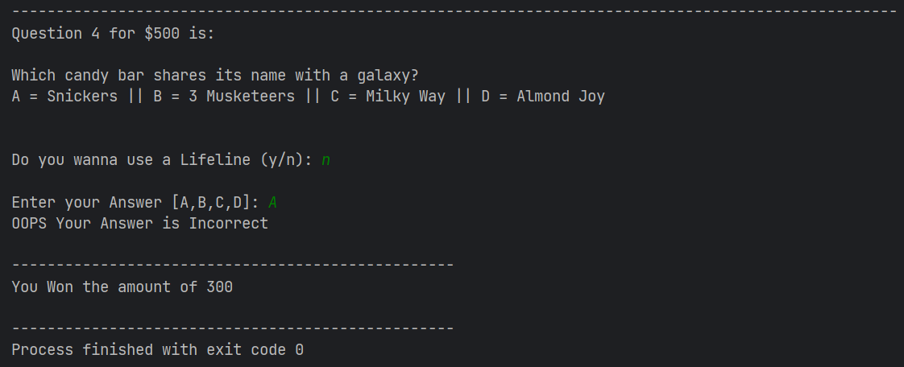

# **Who wants to be a Millionaire?**

## **Introduction**

In this Assignment, I have created a Console-based Quiz Game.
There are total 15 questions.

There are 3 difficulty Levels

1. Easy (1 to 5)
2. Moderate (6 to 10)
3. Hard (11 - 15)

## **Game Features**

4 Lifelines are given to users

1. Audience Poll = Correct answer will appear
2. X2 = User will get 2 chances
3. 50:50 = 2 options will be omitted
4. Call an Expert = Correct answer will appear

Moreover, user can quit the game and get the previous price amount.
There are stops just like the Real Game.  
  
## **Programming Language and Technologies used**

- [x] Java
- [x] JetBrains IntelliJ

## **Concepts Used**

> Correlation between main and reference files
>
> Global and Local variable
>
> Loops (if, if..else, if else-if block, while, do-while, for, switch)
>
> 1-D and 2-D array
>
> Java Packages (Scanner, Random, Lang)
>
> Exceptional Handling (try-catch block)

## **Resources**

1. College Notes
2. YouTube Tutorials
3. W3Schools
4. LearnVern
5. Udemy

## **Game Screenshots**

<h3>Introduction</h3>

<h3>Game</h3>

<h3>Using Lifelines</h3>

<h3>Terminating the Program</h3>

 # 
**A Big Thank You!**

