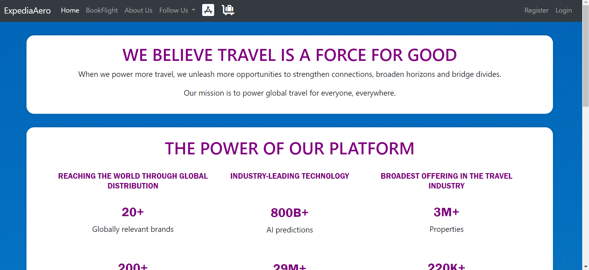

# **ExpediaAero - A MERN Application**

## **Introduction**

*This is an application to search for flight. It resonance to the Expedia flight booking website.*

## **Programming Language and Technologies used**

* [x] MongoDB, Express, React, Node.js, Bootstrap

* [x] npm packages

* [x] Google API

* [x] GitHub API

* [x] Visual Studio Code

* [x] Git

* [x] Render

## **Concepts Used**

> 1. MongoDB connection using Mongoose
>
> 2. Express Routes
>
> 3. React Components

## **Resources**

1. College Lecture Notes
2. Documentation of npm packages
3. Google
4. Stack Overflow
5. W3Schools

## **Screenshots**

<h2><b>1. Home Page</b></h2>

<h2><b>2. Flight Details</b></h2>

<h3>General Public</h3>

<h3>User</h3>

<h3>Admin</h3>

<h2><b>3. About Us</b></h2>

<h2><b>4. Follow US</b></h2>

<h2><b>5. Login Page</b></h2>

<h2><b>6. Register Page</b></h2>

 

<h2><b>7. Google</b></h2>

 

<h2><b>8. User's Cart</b></h2>

 

<h2><b>9. Payment</b></h2>

 

<h2><b>10. Thank You</b></h2>

 

# 
**A Big Thank You!**

